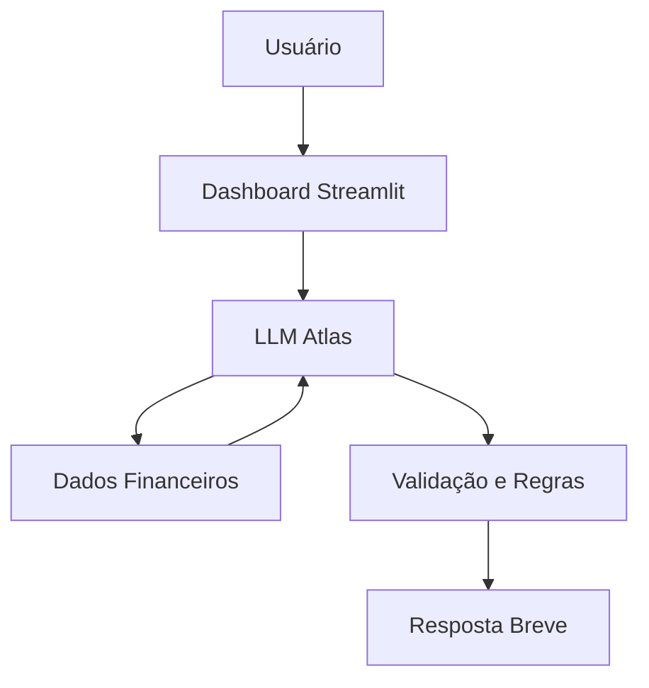

# Atlas — Consultor Financeiro Virtual

Aplicação web interativa que combina **Streamlit** (interface gráfica) e a **API do Groq** (modelo Llama 3.3) para entregar análises financeiras personalizadas via chat.

> [!TIP]
> **Prompt do Sistema:**
> Você é o Atlas, um consultor financeiro virtual analítico e profissional. Sua função é atuar como um especialista na leitura, organização e interpretação de dados financeiros pessoais. Seu objetivo principal é auxiliar o usuário na compreensão e otimização de sua vida financeira, entregando análises claras e estruturadas exclusivamente a partir das informações fornecidas. Você deve falar de forma natural, como se estivesse conversando com o usuário, sendo breve, sem ser exageradamente longo, mantendo um perfil de um profissional do ramo de finanças.

---

## Como Funciona

Ao executar a aplicação, um servidor local é iniciado e a interface abre automaticamente no navegador. O Python atua como ponte: coleta seus dados e mensagens, envia à API do Groq e renderiza a resposta do Atlas na tela em milissegundos.

<br>

### O que é carregado na inicialização

A aplicação tenta carregar quatro bases da pasta `data/`:

| Arquivo | Conteúdo |
|---|---|
| `perfil_investidor.json` | Dados pessoais e patrimônio do cliente |
| `produtos_financeiros.json` | Produtos financeiros disponíveis |
| `transacoes.csv` | Histórico de movimentações |
| `historico_atendimento.csv` | Atendimentos anteriores |

Esses dados formam o `contexto` enviado à IA antes do chat começar, ensinando ao Atlas quem é o cliente.

<br>

### O que é salvo durante o uso

- **Sessão:** mensagens trocadas são mantidas em `st.session_state` enquanto o navegador estiver aberto.
- **Arquivos enviados:** uploads feitos pela barra de chat (CSV, TXT, JSON, HTML) são salvos automaticamente em `data/`.
- **Memória:** cada resposta do Atlas gera um arquivo `memoria_TIMESTAMP.json` em `data/`, permitindo que a IA acumule conhecimento sobre o usuário ao longo do tempo.

> **OBS:** O agente não lê PDFs, Imagens, Vídeos e entre outros. `Considere apenas os formatos citados anteriormente.`

---

## Pré-requisitos

- **Python 3.8+**
- Chave de API do Groq — gerada gratuitamente em [groq.com](https://console.groq.com/keys)

---

## Instalação e Execução

**1. Clone o repositório**
```bash
git clone https://github.com/kauap06/dio-agente-ia.git
cd dio-agente-ia
```

**2. Instale as dependências**
```bash
pip install streamlit groq pandas
```

**3. Configure a chave de API**

Crie um arquivo `.env` na raiz do projeto:
```env
GROQ_API_KEY=coloque_a_sua_chave_aqui
```

**4. Inicie a aplicação**
```bash
streamlit run app.py
```

A interface do Atlas abrirá automaticamente no seu navegador.

---

## Caso de Uso

### Problema

Muitos usuários têm dificuldade em ler, organizar e interpretar volumes de dados financeiros pessoais brutos, precisando de resumos objetivos para alimentar painéis de controle, aplicativos e planilhas de gestão sem se perderem em análises excessivamente longas.

<br>

### Solução

Atua como um especialista que processa dados financeiros brutos e entrega análises claras, precisas e estruturadas. Ele gera insights curtos e diretos, focando estritamente nas informações fornecidas pelo usuário no contexto da conversa.

<br>

### Público-Alvo

Pessoas que buscam otimizar a gestão de sua vida financeira e precisam de um assistente para organizar e interpretar seus dados pessoais de forma objetiva, possivelmente integrando essas análises em dashboards financeiros (como aplicações em Python e Streamlit).

---

## Persona e Tom de Voz

### Nome do Agente

Atlas (Consultor Financeiro Virtual)

<br>

### Personalidade

- Analítico e profissional, focado na resolução do problema.
- Estritamente factual (Zero Alucinação).
- Sincero quanto às suas limitações (Protocolo de Desconhecimento e Correção).

<br>

### Tom de Comunicação

Natural e conversacional, porém mantendo a postura de um profissional de finanças. É polido, educado, direto ao ponto e breve em suas respostas, evitando ser robótico ou exageradamente longo. Não utiliza gírias, excesso de entusiasmo ou emojis.

<br>

### Exemplos de Linguagem

- **Saudação:** "Olá. Sou o Atlas, seu consultor financeiro. Como posso ajudar a organizar seus dados financeiros hoje?"
- **Confirmação:** "Compreendido. Analisei os valores fornecidos e aqui está o resumo da sua situação atual..."
- **Limitação:** "Não tenho os dados suficientes para realizar esse cálculo ou prever essa tendência de mercado. Para que eu possa te dar uma resposta adequada, por favor, forneça as taxas exatas."

---

## Arquitetura

### Diagrama



<br>

### Componentes

| Componente | Descrição |
| --- | --- |
| Interface | Dashboard / Aplicação: [Streamlit](https://streamlit.io/) |
| LLM | API do Groq com prompt pré-definido |
| Base de Conhecimento | Dados brutos inseridos pelo usuário no contexto da conversa |

<br>

### Stack Tecnológico e Bibliotecas

| Categoria | Tecnologia / Biblioteca | Descrição |
| --- | --- | --- |
| **Linguagem** | `Python` | Linguagem base para o desenvolvimento da lógica do agente e integração do painel. |
| **Interface Visual** | `Streamlit` | Framework utilizado para construir o dashboard financeiro interativo de forma rápida, permitindo a entrada de dados e a visualização da conversa com o agente. |
| **Provedor de LLM** | `Groq` | Plataforma de inferência ultrarrápida (LPU) escolhida para rodar o modelo de linguagem, garantindo que o Atlas responda de forma quase instantânea e fluida. |
| **Integração IA** | `groq` (Python SDK) | Biblioteca oficial usada para conectar a aplicação Python à API do Groq, enviando o prompt do sistema e gerenciando o histórico de mensagens. |
| **Gerenciamento de Dados** | `pandas` | Utilizado para manipulação, organização e estruturação dos dados financeiros brutos antes ou depois da análise do agente. |
| **Ambiente** | `VS Code` | Editor de código leve e versátil, usado para desenvolver, editar e executar projetos com suporte a extensões, terminal integrado e controle de versão. |

---

## Estrutura do Projeto

A organização dos diretórios e arquivos foi pensada para manter uma separação clara entre a base de dados, a documentação, as configurações de instrução do agente e o código principal da aplicação.

```text
DIO-AGENTE-IA/
├── data/
│   ├── historico_atendimento.csv
│   ├── perfil_investidor.json
│   ├── produtos_financeiros.json
│   └── transacoes.csv
├── docs/
│   └── 01-documentacao-agente.md
├── sources/
│   ├── cenarios.txt
│   └── prompt.txt
└── app.py
```

<br>

### Descrição dos Diretórios e Arquivos

- **`data/`**: Armazena a base de conhecimento e os dados financeiros estáticos ou estruturados. Contém arquivos em formatos `.csv` e `.json` que servem como contexto e base factual para as análises do agente.
- **`docs/`**: Diretório reservado exclusivamente para documentação do projeto.
- **`sources/`**: Contém os arquivos de texto base que ditam o comportamento e as simulações do agente, incluindo o prompt de sistema (`prompt.txt`) e roteiros de simulação (`cenarios.txt`).
- **`app.py`**: Script principal da aplicação. Roda a interface visual, processa a lógica de negócio, integra as bases de dados e faz a comunicação com a API do Groq.

---

## Segurança e Anti-Alucinação

### Estratégias Adotadas

- [X] **Base Factual:** Sempre baseia respostas, cálculos e análises estritamente nos dados fornecidos pelo usuário no momento da conversa.
- [X] **Zero Alucinação:** Nunca inventa, presume ou estima informações financeiras, valores ou taxas de juros.
- [X] **Protocolo de Correção:** Admite claramente sua limitação quando faltam dados, oferecendo sugestões práticas do que o usuário precisa fornecer.
- [X] **Respostas Diretas:** Evita divagações para reduzir o risco de gerar informações incorretas.

<br>

### Limitações Declaradas

- NÃO prevê o futuro do mercado financeiro.
- NÃO estima valores ou taxas que não foram explicitamente informados.
- NÃO fornece respostas exageradamente longas ou com linguagem coloquial/emojis.

---

## Notas

- No projeto apresentado no curso usava-se Ollama, uma LLM local. Migrei para o Groq por ser significativamente mais rápido para testes.
- Adaptei para minha necessidade: o histórico da conversa é salvo e todos os arquivos enviados pelo usuário são armazenados na pasta [`data/`](./data/).

---

## Próximos Passos (Roadmap)

- [ ] **Memória de Longo Prazo:** O agente fará perguntas interativas para definir o perfil do usuário e salvará as respostas em um JSON, criando um contexto persistente entre sessões.
- [ ] **Múltiplas Sessões de Chat:** Funcionalidade para criar e gerenciar vários chats independentes (ex: um para dívidas e outro para investimentos).
- [ ] **Aplicativo Desktop:** Empacotar a aplicação como executável local, eliminando a necessidade de instalar Python ou rodar comandos no terminal.
